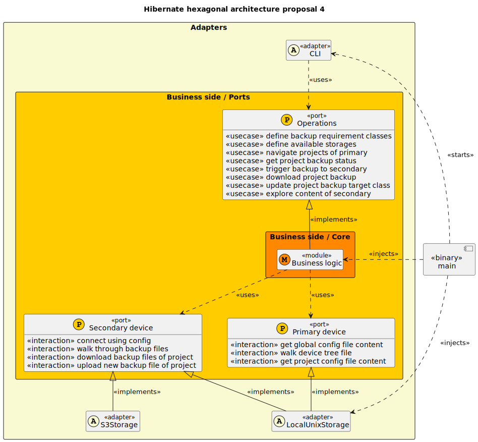

# Proposal number 4: main modules

Modules are the core elements of a rust crate. If we have to do a minimal amount
of upfront design, identifying responsibilities of modules seems the thing to do

## Hexagonal architecture proposal

Following principles of the hexagonal architecture, the interfaces are defined
business side, and the user side and server side depends on the business side,
not the opposite. The business side defines ports and business logic depending
on them, and the user and server side define adapter implementing ports.

We quite clearly see 3 main ports: one to interact with the user, one to interact with the primary device (the actual data) and one to interact with the secondary devices (the backups). These ports are interfaces (or traits in rust) that will be implemented by modules with concrete knowledge of the actual devices. Some modules might implement both the primary and secondary devices, but the business logic should not depend on it.

The 3 layers are represented in the following diagram:



## Actual modules structure proposal

```rs
mod hibernate {
    // Business logic implementation
    mod core {
        mod global_config;
        mod project_config;
        mod projects_scan;
        mod project_status;
        mod backup_exploration;
        mod backup_execution;
        mod restore_execution;
    }

    // Public structures (low behavior, high data)
    pub mod models {
        pub mod backup_requirement;
        pub mod primary_device;
        pub mod secondary_device;
        pub mod project;
    }

    // Adapters (interfaces implemented by core)
    pub mod adapters {
        pub mod primary_device;
        pub mod secondary_device;
        pub mod operations;
    }
}
```

Then the actual implementations of the primary and secondary devices:

```rs
// concrete implementations of storage (local, remote, ...)
mod devices {
    mod local_unix_file_storage;
    // ...
}
```

Finally the interactions with the user : the **User side** modules:

```rs
// Interactions with user
mod cli;
```
