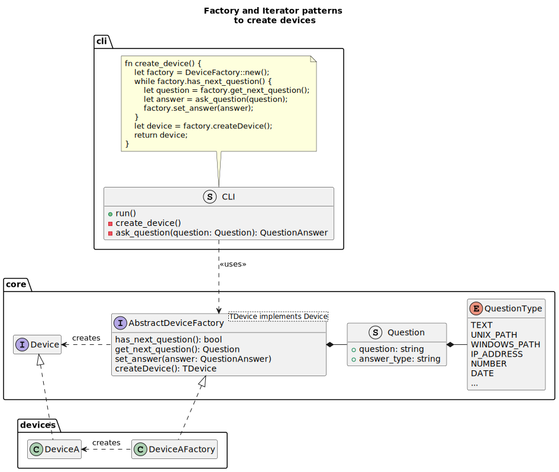

# Data structures proposal

A few low behavior data structures and traits need to be defined to be used as
input and output of interfaces. This proposal attempt to specify them.

## Backup requirement class

The user can specify for each project what is his target for backups. For low
importance projects, he might want a single copy on a secondary partition on the
same physical device, while for highly sensitive data he might want to set a
higher target. We may specify such target with the structure:

```rs
enum SecurityLevel {
    // Connected to network, no authorization required
    NetworkPublic,              // referenced, accessible to anyone
    NetworkUnreferenced,        // unreferenced, accessible to anyone

    // Connected to network, authorization required
    NetworkUntrustedRestricted, // untrusted provider (e.g. under the PATRIOT Act)
    NetworkTrustedRestricted,   // trusted provider

    // Connected to a local only network
    NetworkLocal,               // local network, no internet access

    // Disconnected from network
    Local,                      // local location
    LocalMaxSecurity,           // local location with maximum security (in a safe?)
}

struct BackupRequirementClass {
    // The number of distinct copies we want to keep (including the primary)
    target_copies: u32 = 3,

    // The number of distinct physical locations we want to keep the copies
    target_locations: u32 = 1,

    // The minimum security level of the backups
    min_security_level: SecurityLevel = SecurityLevel::NetworkUntrustedRestricted,

    // Name of the backup requirement class
    name: String,
}
```

## Project status

A project might have several statuses:

```rs
enum ProjectTrackingStatus {
    // The project is explicitly not tracked, as specified in the global config
    Ignored,

    // The project is explicitly tracked, it has a config file
    Tracked,

    // The project is not yet specified. This is a risk and the user should
    // eventually specify it.
    Unspecified,
}

struct ProjectBackupStatus {
    // What is the last time a backup was made
    last_backup: Option<Instant>,

    // Is the secondary device where this backup is stored currently connected?
    currently_connected: bool,
}

struct ProjectStatus {
    // The tracking status of the project
    tracking_status: ProjectTrackingStatus,

    // The current copies
    current_copies: Vec<ProjectBackup>,

    // Last update of the project content
    last_update: Instant,
}
```

## Project

The project structure is the main data structure that will be used to represent a
project. It will contain all the information provided by the user about his
project:

```rs
struct Project {
    // The name of the project
    name: String,

    // An indicative location of the project location
    // Actual location type depends on the primary device type
    // The exact API might be found later
    location: String,

    // The target backup requirement class
    backup_requirement_class: BackupRequirementClass,

    // Status of the project
    status: ProjectStatus,
}
```

## Device

A device is a storage location where backups can be stored. It can be a local or on a network. A simple representation of

```rs
struct Device {
    // The name of the device
    name: String,

    // The physical location of the device (home, work, aws, ...)
    location: String,

    // The security level of the device
    security_level: SecurityLevel,

    // The type of the device
    device_type_name: String

    // The last time the device was connected
    last_connection: Option<Instant>,

    // The last time the device was disconnected
    last_disconnection: Option<Instant>,
}
```

To be able to register new devices, the user will probably need to provide
some information about the device, that depends on the device type, so on
the other side port. To avoid coupling the CLI with the device type, we
will need to define traits allowing for the device to get the required information.

The following combination of the iterator pattern and the factory pattern
might be a good way to do it:


